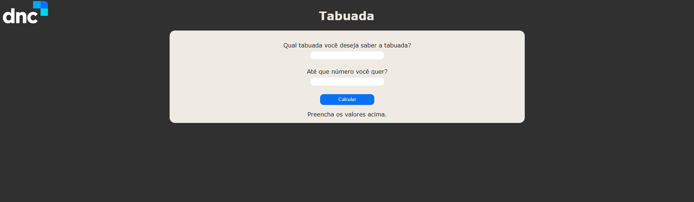

# Taboada JavaScript

Este é um projeto simples em JavaScript que permite calcular a tabuada de um número inserido pelo usuário. A tabuada é exibida na tela de forma clara e legível, facilitando a visualização e compreensão dos resultados.

## Funcionalidades

- Calcula a tabuada de um número inserido pelo usuário.
- Exibe a tabuada de forma organizada na tela.
- Interface simples e intuitiva, fácil de usar.

## Tecnologias Utilizadas

- HTML5
- CSS3
- JavaScript

## Como Usar

1. Abra o arquivo `index.html` em seu navegador.
2. Insira um número na caixa de entrada.
3. Clique no botão "Calcular".
4. A tabuada correspondente será exibida na tela.

## Responsividade

Este projeto foi desenvolvido com design responsivo para smartphones.

## Contribuindo

Contribuições são bem-vindas! Sinta-se à vontade para enviar pull requests com melhorias, correções de bugs ou novas funcionalidades.

Se você encontrar algum problema ou tiver sugestões para melhorar o projeto, por favor, abra uma issue.

## Link do Projeto

O projeto está disponível [aqui](https://danieljavacoffee.github.io/tabuada/).

## Imagem do Projeto

